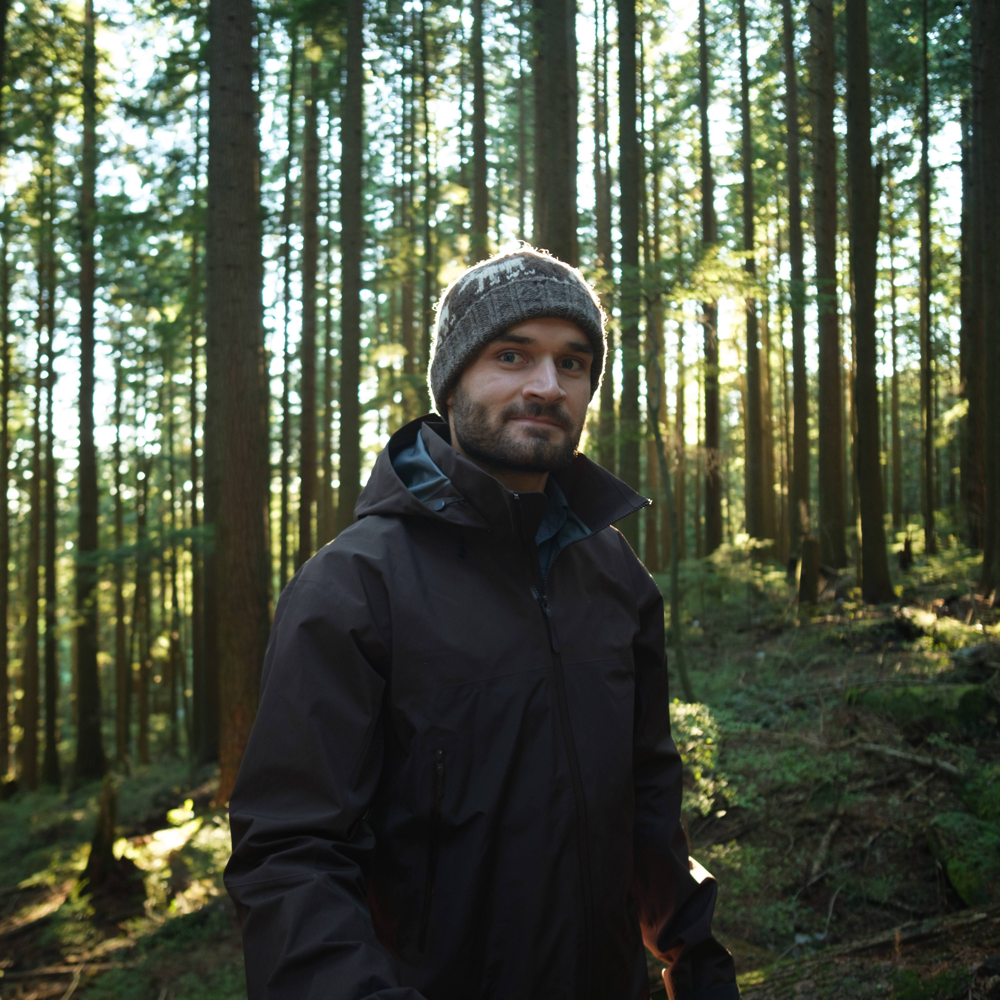

## About

Riley Paul is a photographer and engineer, born and raised among the foothills of the Canadian Rockies. He has traveled all across Canada, from coast to coast. He spent five years on the island of Newfoundland pursuing his degree and now lives on the west coast in Vancouver.

Best known for his outdoor photography and portraiture - he prides himself on his ability to discover beauty in unexpected places. He has had an interest in photography since 2015.

If you are interested in working together, please don't hesitate to get in touch.
